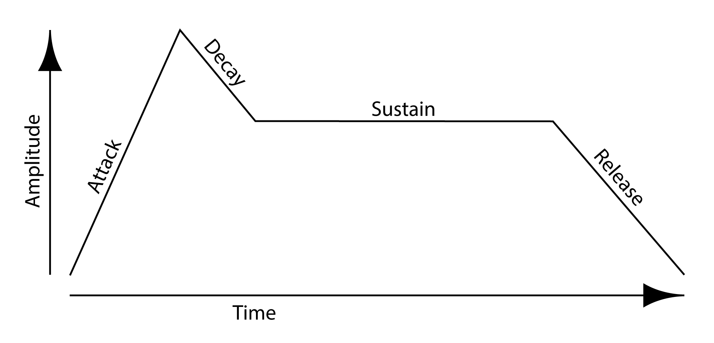

# Envelope

Envelopes shape an [AudioSample](../audiosample/index.md)'s volume over time, giving its sound individual quality or [*timbre*](https://en.wikipedia.org/wiki/Timbre).

Envelope objects are used to help shape the sound of [AudioSample instruments used to play notes](../../play/audio.md). They utilize four adjustable parameters:



- **Attack** models the beginning of the sound, i.e, how long it takes for the sound to begin sounding fully, once it has been started. It is the initial build up of the sound.
- **Delay** models the initial loss of energy after the Attack, i.e., how long it takes for the sound to reach its normal level, after the maximum of the initial attack.
- **Sustain** models how long the sound maintains its normal level.
- **Release** models the end of the sound, i.e., how long it takes for the sound to finish sounding, after it has been stopped.

All times are in milliseconds, each measured from the previous one. The exceptions are the first attack time (measured from the start of the sound) and the release time (which extends past the end of the sound). Volumes run from 0.0 (silence) to 1.0 (full).

For more information on Envelopes, see [here](https://www.teachmeaudio.com/recording/sound-reproduction/sound-envelopes/) and [here](https://www.britannica.com/science/envelope-sound).

## Creating an Envelope

You can create an Envelope using the following functions:

```python
Envelope()
```

```python
Envelope(attackTimes, attackVolumes, delayTime, sustainVolume, releaseTime)
```

| Parameter | Type | Default | Description |
|---|---|---|---|
| `attackTimes` | `list[int]` | `[2, 20]` | The attack times, in milliseconds, each measured from the previous one (the first from the start of the sound). |
| `attackVolumes` | `list[float]` | `[0.5, 0.8]` | The volumes to reach at the attack times, each from 0.0 to 1.0; parallel to attackTimes. |
| `delayTime` | `int` | `20` | How long to take reaching the sustain volume, in milliseconds after the last attack time. |
| `sustainVolume` | `float` | `1.0` | The volume held through the body of the sound, from 0.0 to 1.0. |
| `releaseTime` | `int` | `150` | How long the sound takes to fade to silence after it ends, in milliseconds. |

For example,

```python
envelope = Envelope([100, 200], [0.8, 1.0], 300, 0.6, 1200)
```

creates an Envelope object `envelope`, which may be used to [help shape an AudioSample](../../play/audio.md).

## Functions

Once an Envelope `envelope` has been created, the following functions are available:

| Function | Description |
|---|---|
| [`envelope.getAttackTimesAndVolumes()`](getAttackTimesAndVolumes.md) | Return the envelope's attack times and the volumes reached at them. |
| [`envelope.setAttackTimesAndVolumes(attackTimes, attackVolumes)`](setAttackTimesAndVolumes.md) | Set the envelope's attack times and the volumes reached at them. |
| [`envelope.getSustainVolume()`](getSustainVolume.md) | Return the envelope's sustain volume. |
| [`envelope.setSustainVolume(sustainVolume)`](setSustainVolume.md) | Set the envelope's sustain volume. |
| [`envelope.getDelayTime()`](getDelayTime.md) | Return the envelope's delay time. |
| [`envelope.setDelayTime(delayTime)`](setDelayTime.md) | Set the envelope's delay time. |
| [`envelope.getReleaseTime()`](getReleaseTime.md) | Return the envelope's release time. |
| [`envelope.setReleaseTime(releaseTime)`](setReleaseTime.md) | Set the envelope's release time. |
| [`envelope.performAttackDelaySustain(audioSample, volume, voice)`](performAttackDelaySustain.md) | Apply the envelope's attack, delay, and sustain to a voice of an audio sample. |
| [`envelope.performReleaseAndStop(audioSample, voice)`](performReleaseAndStop.md) | Apply the envelope's release (fade-out) to a voice of an audio sample, then stop it. |

## Example

The following demonstrates how to use an envelope to shape the sound of a loop:

```python title="audioLoopWithEnvelope.py"
--8<-- "examples/_snippets/audioLoopWithEnvelope.py"
```
