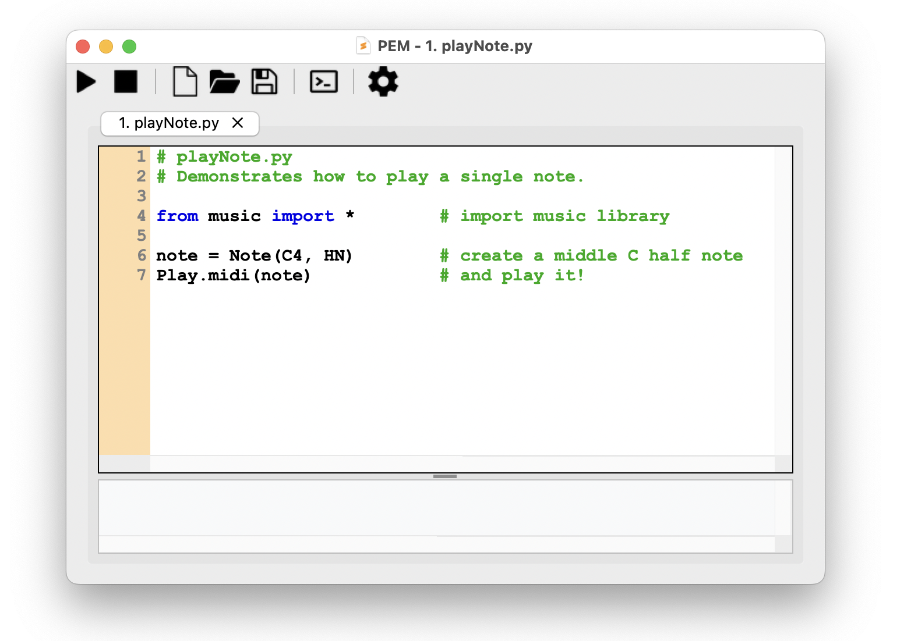

# Download

## Platforms

PythonMusic runs on Windows, Mac, and Linux.

## Download and Install

To install PythonMusic, simply download the **PEM** (Python Environment for Music) editor. 

<figure markdown="span">
  
  <!-- <figcaption>PEM editor window (in MacOS)</figcaption> -->
</figure>

PEM is bundled with all PythonMusic libraries, and other essential Python libraries.  It should be enough for most uses. 

**NOTE:** For more advanced users, see [install PythonMusic via ```pip```](#install-via-pip-advanced). 

### Windows

1. [Download PEM for Windows](https://github.com/ydhadix/PythonMusic/releases/latest/download/PEM-Windows.zip).
2. Unzip the downloaded file.
3. Double-click **PEM.exe** to run.
4. (Optional) Right-click PEM.exe, and select "Create Shortcut". Move this shortcut to your Desktop for easy access.

### Mac

1. [Download PEM for MacOS](https://github.com/ydhadix/PythonMusic/releases/latest/download/PEM-macOS-AppleSilicon.tar.gz).
2. Double-click the downloaded file to extract **PEM**.
3. Move **PEM** to your Applications folder.
4. Double-click PEM to run.
5. (Optional) While PEM is running, control-click the PEM icon on the taskbar. Select “Options” and “Keep in Dock” for easy access.

#### Mac Security Issue

Some versions of MacOS flag the PEM application as damaged (or malware).  This is a common issue caused by Apple's strict security protocols, and does not mean the application is unsafe. If so:

1. Select “Cancel” (not "Move to Trash"!).
2. Open System Settings. 
3. In “Privacy & Security”, scroll down to see a Security alert for PEM. 
4. Select “Allow”, and open PEM again.

Alternatively - after you move PEM to the Applications folder:

1. Open a Terminal window.
2. Type this command: 

```
sudo xattr -dr com.apple.quarantine /Applications/PEM.app/
```


### Linux (and Intel Mac)

The PEM executable is not available for Linux and Intel-based Macs.

To install PythonMusic see [install via pip](#install-via-pip-advanced).

---

## Download the Examples

PythonMusic comes with [online examples](examples/index.md).  You can also [download them](examples/PythonMusic_Examples.zip){ download }.


---

## Install via pip (Advanced)

For more advanced users, install PythonMusic via ```pip```.  This provides access to the full Python ecosystem of libraries:

1. Make sure you have [Python3](https://www.python.org/downloads/) installed (version 3.12 or greater). 
2. Open Terminal, and type: 

```
pip install PythonMusic
```


### PEM

Once PythonMusic is installed with ```pip```, you can access PEM via the command line:  


```
python -m pem
``` 
or simply: 

```
pem
```  

You can also open a file with PEM:

```
python -m pem <filename.py>
```

or

```
pem <filename.py>
```

### Troubleshooting

#### "CMake configuration failed"

Some of PythonMusic's dependencies may need to compile C++ code during installation.

- On Windows, download and install [Visual Studio Build Tools 2022](https://visualstudio.microsoft.com/downloads/).  In the Visual Studio installer, make sure "Desktop Development with C++" is checked.

- On MacOS, you can download and install [XCode from the App Store](https://apps.apple.com/us/app/xcode/id497799835?mt=12).

Restart your computer, then try installing PythonMusic again.


---

# Using PythonMusic

PythonMusic's core modules are the [`music`](api/music/index.md), [`gui`](api/gui/index.md), [`timer`](api/timer/index.md), [`osc`](api/osc/index.md), and [`midi`](api/midi/index.md) libraries.  You can import these libraries into your python code using:

```python
import music
```
```python
from music import *
```
```python
from music import Note, Play, C4, HN
```

Or a similar statement.  PythonMusic includes a number of useful constants, so we recommend using wildcard imports like `from music import *`.

**NOTE:** The first time you import `music`, PythonMusic will ask to download a high-quality soundfont (FluidR3 G2-2.sf2) for you.  This is necessary to play high quality MIDI sounds, and only needs to happen once.

## Running PythonMusic Programs

There are several ways to run PythonMusic programs:

- Use provided PEM editor (for beginners – easiest)

- Use Sublime editor (for intermediate users)

- Use VS Code editor (for intermediate users)

- Use Atom editor (for intermediate users)

- Use Atom editor (for advanced users – very customizable)

- Use terminal window (for advanced users – pure freedom!!!)

**NOTE:** Most advanced editors allow customization – by exploring the above instructions, you should be able to make your preferred editor run PythonMusic, as long as it provides a way to specify which run-time environment to use, when running files.


PythonMusic is designed for use in Python's Interactive Mode.  To run a python program in interactive mode, use a command like:

```
python -i <filename.py>
```

---

