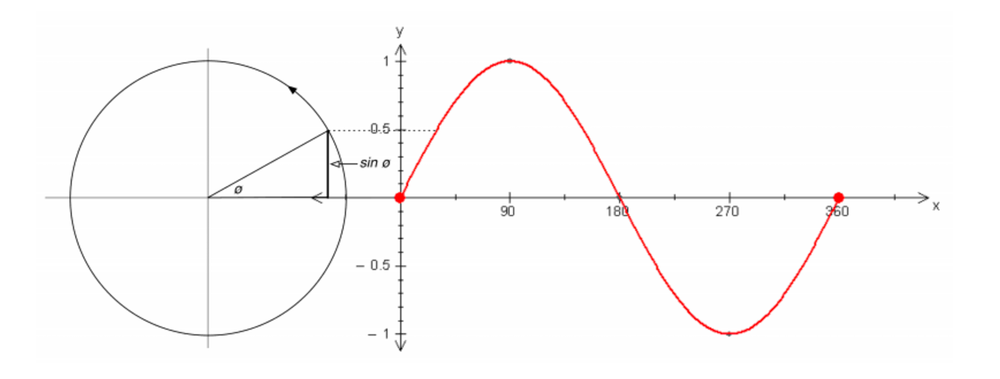
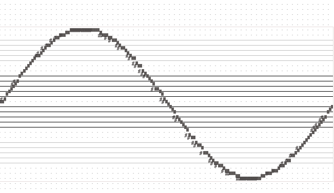
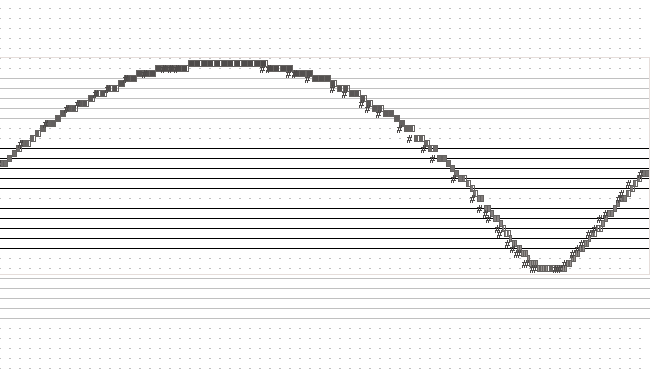
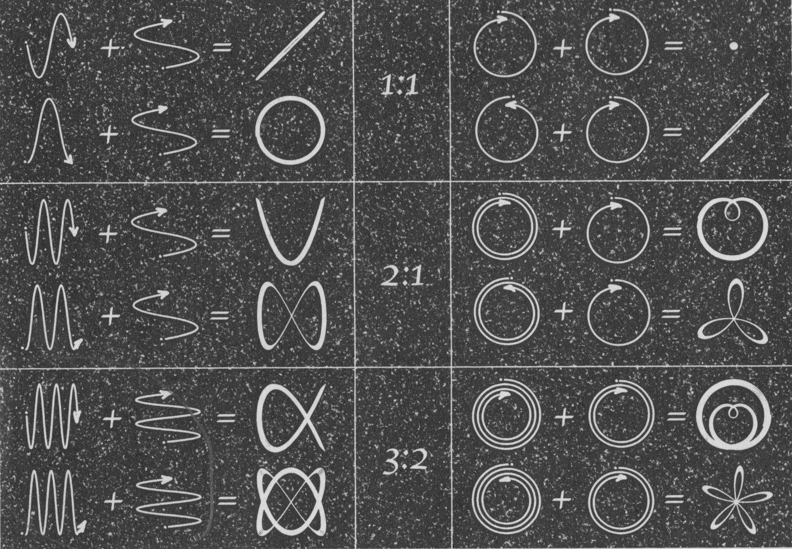
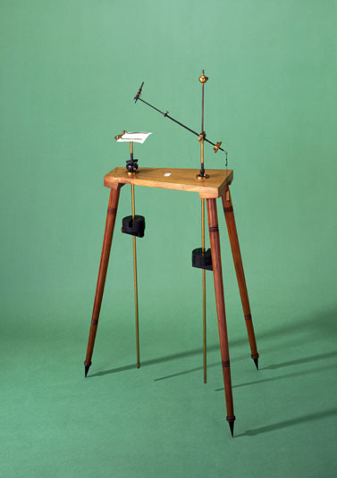
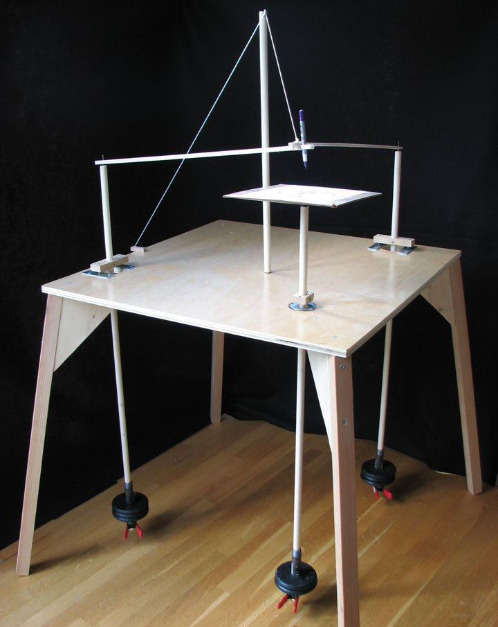
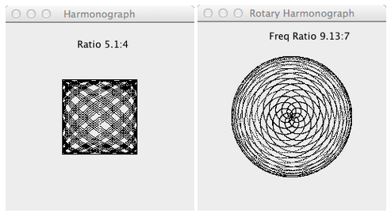

# Chapter 10: Music, Number and Nature

***Topics:***   *Connecting nature, music and number, Pythagorean theorem, music from math curves, sin() and cos() functions, the Python math library, visualizing oscillations, the harmonograph, sonifying oscillations, Kepler’s harmony of the world revisited.*

In the previous chapters, we studied essential building blocks of music and computer science. We now know enough about music and programming to return to the themes introduced in [Chapter 1](ch1.md). In this chapter, we will deepen our exploration into the connections between music, number, and nature, and introduce you to ideas that will hopefully inspire and guide you in your own personal journey into music and programming. More information is provided in the [reference textbook](https://goo.gl/Y1VM5t).

Here is code from this chapter:

- [Making music from math curves](#making-music-from-math-curves)
- [Simulating a lateral harmonograph](#simulating-a-lateral-harmonograph)
- [Simulating a rotary harmonograph](#simulating-a-rotary-harmonograph)
- [Non-integer ratios](#non-integer-ratios)
- [Kepler’s Harmony of the World, No. 2](#keplers-harmony-of-the-world-no-2)

---

## Making music from math curves

A simple mathematical function is the *sine*. It describes a smooth repetitive oscillation (i.e., a wave), as shown below:

<figure markdown="span">
  
  <figcaption>Two complementary views of the sine function: (left) as the rise of a point traversing a unit circle, and (right) as the wave graph been drawn by that point (imagine the circle moving to the right, while the point is rotating)</figcaption>
</figure>

The code sample below ([Ch. 10, p. 321](http://goo.gl/Io4kLk)) demonstrates how to create a simple melodic contour using the Python sin() function. It also creates a visual

It also creates a visual pianoroll, which traces the sine wave oscillation:

<figure markdown="span">
  
  <figcaption>Melodic contour from a sine wave</figcaption>
</figure>

Here is the program:

```python linenums="1" title="sineMelody.py"
--8<-- "examples/_snippets/sineMelody.py"
```

It plays this sound:

<audio controls preload="none" src="../../audio/sineMelody.wav"></audio>

Next we connect additional musical parameters to the sine function, namely, note duration, dynamic, and panning. The piano roll generated by the updated program is shown below. Notice the distortion in the sine wave graph. Why does that happen?

<figure markdown="span">
  
  <figcaption>Melodic contour from sine wave also mapped to duration of notes</figcaption>
</figure>

Here is the code:

```python linenums="1" title="sineMelodyPlus.py"
--8<-- "examples/_snippets/sineMelodyPlus.py"
```

It plays this sound:

<audio controls preload="none" src="../../audio/sineMelodyPlus.wav"></audio>

---

## The Harmonograph

The [harmonograph](http://en.wikipedia.org/wiki/Harmonograph) is used to study harmonic oscillations.  It has a pen and two pendula moving in orthogonal directions. As the pendula move, the pen draws on paper.

There are two versions, lateral and rotary.

Harmonographs are used to visualize music intervals (harmonic ratios).  For example, here are shapes generated from different harmonic ratios (i.e., 1:1, 2:1, and 3:2).  Lateral harmonograph on the left; rotary harmonograph on the right.

<figure markdown="span">
  
  <figcaption>Using lateral harmonograph (left) and rotational harmonograph (right) to draw shapes for different ratios (e.g., 1:1, 2:1, etc.) (Ashton, 2003, p. 19)</figcaption>
</figure>

## Simulating a lateral harmonograph

A *lateral harmonograph* has a pen attached to two pendula moving in orthogonal directions (see below).  As pendula move, the pen draws on paper.

<figure markdown="span">
  { width="280" }
  <figcaption>A lateral harmonograph</figcaption>
</figure>

The code sample below ([Ch. 10, p. 328](https://goo.gl/Y1VM5t)) simulates a lateral harmonograph.  We may adjust:

- Length of pendula — this affects frequency of oscillation. By combining different frequency ratios (e.g., 2:3), we get different shapes (as shown above).
- Phase of pendula, relative to one another.  This can be same, or reverse.

Here is the code:

```python linenums="1" title="harmonographLateral.py"
--8<-- "examples/_snippets/harmonographLateral.py"
```

It generates this shape:

<iframe class="pm-demo" style="max-width: 250px; aspect-ratio: 250 / 236;" src="https://video.wordpress.com/embed/c1Cf4jIb?preloadContent=metadata&controls=1" title="Lateral harmonograph demo" allowfullscreen></iframe>

---

## Simulating a rotary harmonograph

A *rotary harmonograph* has a pen attached to two pendulums moving in orthogonal directions. As the pendulums move, the pen draws on paper. The paper is placed on a third pendulum on a rotary bearing (i.e., gimbals).  This provides another oscillation to the system.

<figure markdown="span">
  { width="280" }
  <figcaption>A rotary harmonograph</figcaption>
</figure>

The code sample below ([Ch. 10, p. 330](https://goo.gl/Y1VM5t)) simulates a rotary harmonograph. We may adjust:

- Length of pendula — this affects frequency of oscillation. By combining different frequency ratios (e.g., 2:3), we get different shapes (as shown above).
- Phase of pendula, relative to one another.  This can be same, or reverse.

This program can also dampen oscillations (via friction). To do so, uncomment the last two statements. This introduces more interesting shapes.

Here is the code:

```python linenums="1" title="harmonographRotary.py"
--8<-- "examples/_snippets/harmonographRotary.py"
```

It generates the following shape.

**NOTE:** This is also the shape drawn by planet Venus on Earth’s sky (Venus rotates around the Sun about 13 times for every 8 Earth rotations). This observation (and trying to explain it) may have been the beginning of science (math, astronomy, physics) and music (scales) by the ancients. The above program distills all those centuries of knowledge development, in just a few lines.

<iframe class="pm-demo" style="max-width: 250px; aspect-ratio: 250 / 250;" src="https://video.wordpress.com/embed/UBzRVTk0?preloadContent=metadata&controls=1" title="Rotary harmonograph demo" allowfullscreen></iframe>

---

## Non-integer ratios

Non-integer ratios correspond to musical intervals that are not harmonious (and not pleasing to the ear).

Such ratios generate chaotic paths as traced by the harmonograph. When exploring, increase the value of variable *times* to allow the pen to trace orbits over several cycles – to better see the behavior that emerges.

For example, here are two shapes generated by non-harmonic ratios (5.4 : 4, and 9.13 : 7).

<figure markdown="span">
  
  <figcaption>(Left) Lateral harmonograph – 5.01 : 4 ratio, same phase, 6 times. (Right) Rotary harmonograph – 9.13 : 7 ratio, same phase, 6 times.</figcaption>
</figure>

Certain ratios result in paths that will never converge (i.e., never re-trace the same path).

**NOTE:**  The faster a ratio begins to retrace the same path, the more harmonious (consonant) it sounds to our ear.  See Legname’s Theory on Density of Intervals ([Legname 1998](http://www.oneonta.edu/faculty/legnamo/theorist/density/density.html)).

---

## Kepler’s Harmony of the World, No. 2

Here is another sonification of the planets, influenced by the harmonograph above (also see [chapter 7](ch7.md)).

This code sample ([Ch. 10, p. 334](https://goo.gl/Y1VM5t)) sonifies planetary velocities.  It uses sines and cosines to simulate movement (sound spatialization).

Here is the code:

```python linenums="1" title="harmonicesMundiRevisisted.py"
--8<-- "examples/_snippets/harmonicesMundiRevisisted.py"
```

It plays this sound:

<audio controls preload="none" src="../../audio/harmonicesMundiRevisisted.wav"></audio>

(use stereo headphones to hear movement – front-to-back, and left-to-right)

For more details, see this [book](https://goo.gl/Y1VM5t).
