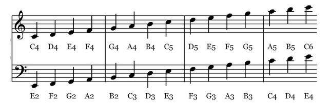
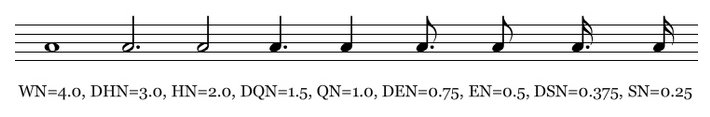

# Chapter 2: Elements of Music and Code

***Topics:**  Fundamentals of music, the Python music library, notes, rests, variables, integers and floats, arithmetic operations, input and output, coding a program.*

This chapter provides an overview of music representations, and corresponding ways to represent data and information in Python.  This chapter is mainly for people with little or no background in music or computer programming.  More information is provided in the [reference textbook](https://goo.gl/Y1VM5t).

Here is code from this chapter:

- [Play a musical note](#play-a-musical-note)
- [Find the octave of a MIDI note](#find-the-octave-of-a-midi-note)

---

## Notes

A [note](../api/music/transcription/note/index.md) in Python consists mainly of [pitch](../api/music/constants/pitch.md) and [duration](../api/music/constants/duration.md).  (It may also include information about [dynamic](../api/music/constants/dynamic.md) and [panning](../api/music/constants/panning.md).)

***Pitch***

The pitch of a note specifies how high or low the note sounds.  In standard music notation, pitch is represented by the vertical placement of a note on the staff.

In Python, pitches are represented by a letter (C, D, E, F, G, A, or B) followed by the octave (or register) of the pitch (as seen below).



These symbols (e.g., C4) stand for integers and range from 0 to 127.
For example, C4 (middle C on a piano) is 60. This follows the MIDI standard, which represents pitches from 0 (lowest pitch) to 127 (highest pitch). MIDI supports a total of 10 octaves. For comparison, a standard, 88-key piano offers about 7 octaves.

Also see MIDI [pitch constants](../api/music/constants/pitch.md).

***Duration***

The duration of a note specifies how long it sounds.  In standard notation, duration is represented by the type of note head used, and by the attached vertical lines.

In Python, durations are represented by a real number (float).  Common durations include whole, half, quarter, and eighth notes (see below).



A quarter mote is the point of reference, and so it is represented as 1.0 (QN = 1.0). Everything else is represented accordingly.

Also see MIDI [duration constants](../api/music/constants/duration.md).

---

## Play a musical note

Let’s revisit our first program.  Again, this program ([Ch.2, p. 34](http://goo.gl/Io4kLk)) demonstrates how to **play a single musical note**.

```python linenums="1" title="playNote.py"
--8<-- "examples/_snippets/playNote.py"
```

It plays this sound:

<audio controls preload="none" src="../../audio/playNote.wav"></audio>

Now that you know more about note representation in Python, you may change this program to play different notes.

To play a melody, see code samples in [chapter 3](ch3.md).

---

## Find the octave of a MIDI note

Since notes are represented by numbers (pitches are integers, durations are floats), we can use arithmetic to analyze or synthesize music.

**Fact:**  Music is numbers, and numbers are music.

To demonstrate this, the following program ([Ch. 2, p. 45](http://goo.gl/Io4kLk)) shows how to **calculate the octave of a MIDI pitch**.  It also shows how to do input and output, as well as perform arbitrary calculations.

```python linenums="1" title="findPitchOctave.py"
--8<-- "examples/_snippets/findPitchOctave.py"
```
