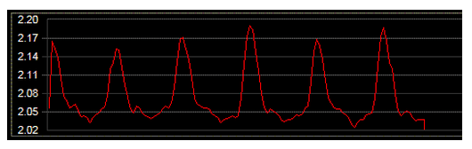
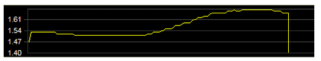

# Chapter 7: Sonification and Big Data

***Topics:*** *Data sonification, mapValue() and mapScale(), Kepler, Python strings, music from text, Guido d’Arezzo, nested loops, file input/output, Python while loop, big data, biosignal sonification, defining functions, image sonification, Python images, visual soundscapes.*

Sonification allows us to capture and better experience phenomena that are outside our sensory range by mapping values into sound structures that we can perceive by listening to them. Data for sonification may come from any measurable vibration or fluctuation, such as planetary orbits, magnitudes of earthquakes, positions of branches on a tree, lengths of words in this chapter, and so on. More information is provided in the [reference textbook](https://goo.gl/Y1VM5t).

Here is code from this chapter:

- [Sonifying planetary data](#sonifying-planetary-data)
- [Making music from text](#making-music-from-text)
- [Recreating Guido d’Arezzo’s “Word Music” (ca. 1000)](#recreating-guido-darezzos-word-music-ca-1000)
- [Sonifying biosignals](#sonifying-biosignals)
- [Sonifying images](#sonifying-images)

---

## Sonifying planetary data

In 1619 Johannes Kepler wrote his “Harmonices Mundi (Harmonies of the World)” book (Kepler, 1619).

This code sample ([Ch. 7, p. 196](https://goo.gl/Y1VM5t)) **sonifies** one aspects of the celestial organization of planets. In particular, it converts **the orbital velocities of the planets to musical notes**.

```python linenums="1" title="harmonicesMundi.py"
--8<-- "examples/_snippets/harmonicesMundi.py"
```

It plays this sound:

<audio controls preload="none" src="../../audio/harmonicesMundi.wav"></audio>

---

## Making music from text

This code sample ([Ch. 7, p. 202](https://goo.gl/Y1VM5t)) **demonstrates how to generate music from text**. This program converts the values of ASCII characters to MIDI pitches. For variety, note durations are randomized; other note properties (volume, etc.) are the same for all notes.

```python linenums="1" title="textMusic.py"
--8<-- "examples/_snippets/textMusic.py"
```

It plays this sound:

<audio controls preload="none" src="../../audio/textMusic.wav"></audio>

---

## Recreating Guido d’Arezzo’s “Word Music” (ca. 1000)

One of the oldest known algorithmic music processes is a rule-based algorithm that selects each note based on the letters in a text, credited to Guido d’Arezzo (991 – 1033).

This code sample ([Ch. 7, p. 207](https://goo.gl/Y1VM5t)) is **an approximation to d’Arezzo’s algorithm**, adapted to text written in ASCII.

```python linenums="1" title="guidoWordMusic.py"
--8<-- "examples/_snippets/guidoWordMusic.py"
```

It plays this sound:

<audio controls preload="none" src="../../audio/guidoWordMusic.wav"></audio>

---

## Sonifying biosignals

Here we explore pre-processing and sonification of data from biological processes. The figure below displays heart data, captured by measuring blood pressure over time.

<figure markdown="span">
  
  <figcaption>Sample raw heart data (x-axis is time, y-axis is pressure)</figcaption>
</figure>

The figure below displays skin conductance, captured by measuring electrical conductivity between two fingers over time.

<figure markdown="span">
  
  <figcaption>Sample skin-conductance data (x-axis is time, y-axis is skin conductance)</figcaption>
</figure>

This code sample ([Ch. 7, p. 217](https://goo.gl/Y1VM5t)) explores one possible sonification of these data.  Before running this program, download [the complete data file](_snippets/biosignals.txt){ download } in your PythonMusic folder.

```python linenums="1" title="sonifyBiosignals.py"
--8<-- "examples/_snippets/sonifyBiosignals.py"
```

It plays this sound:

<audio controls preload="none" src="../../audio/sonifyBiosignals.wav"></audio>

---

## Sonifying images

This code sample ([Ch. 7, p. 231](https://goo.gl/Y1VM5t)) **demonstrates how to sonify (generate music from) images**. It sonifies the following image:

<figure markdown="span">
  
  <figcaption>Loutraki Sunset (320 x 213 pixels)</figcaption>
</figure>

Before running this program, download [this image](_snippets/soundscapeLoutrakiSunset.jpg){ download } in your PythonMusic folder.

Here is the code:

```python linenums="1" title="sonifyImage.py"
--8<-- "examples/_snippets/sonifyImage.py"
```

It plays this sound:

<audio controls preload="none" src="../../audio/sonifyImage.mp3"></audio>

---

## More examples of image sonification

“Daintree Drones” is another example of image sonification to generate a circular piece – by Kenneth Hanson.

<iframe class="pm-video" src="https://player.vimeo.com/video/64110119" title="Daintree Drones - Kenneth Hanson" allowfullscreen></iframe>

This is from a Computing in the Arts student exhibit, entitled “[Visual Soundscapes](https://blogs.cofc.edu/sota/2012/04/05/cita/)“, which was funded in part by the National Science Foundation (DUE #1044861).

Other examples from the exhibit [are available here](https://vimeo.com/cofccita).
