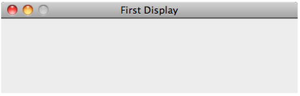
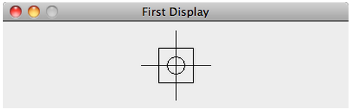

# Chapter 8: Interactive Musical Instruments

***Topics:*** *Computer musical instruments, graphical user interfaces, graphics objects and widgets, event-driven programming, callback functions, Play class, continuous pitch, audio samples, MIDI sequences, paper prototyping, iterative refinement, keyboard events, mouse events, virtual piano, parallel lists, scheduling future events.*

This chapter explores graphical user interfaces and the development of interactive musical instruments.  Interactive computer-based musical instruments offer considerable versatility. They can be used by a single performer or by multiple performers in ensembles, like Laptop Orchestras. It is also possible to have an ensemble that includes both traditional instruments and computer-based instruments. More information is provided in the [reference textbook](https://goo.gl/Y1VM5t).

Here is code from this chapter:

- [Creating a Display](#creating-a-display)
- [Random circles on a Display](#random-circles-on-a-display)
- [A simple musical instrument](#a-simple-musical-instrument)
- [An audio instrument for continuous pitch](#an-audio-instrument-for-continuous-pitch)
- [Changing the background color interactively](#changing-the-background-color-interactively)
- [Drawing musical circles](#drawing-musical-circles)
- [Creating a virtual piano](#creating-a-virtual-piano)
- [Creating a virtual piano – a variation](#creating-a-virtual-piano-a-variation)
- [Using Timers to schedule events](#using-timers-to-schedule-events)
- [Live coding Terry Riley’s “In C”](#live-coding-terry-rileys-in-c)

---

## Creating a Display

To build programs with GUIs, you need the following statement:

```python
from gui import *
```

As with the music library, the [GUI library](../api/gui/index.md) follows Alan Kay’s maxim that “simple things should be simple, and complex things should be possible”.

A program’s GUI exists inside a display (window).  [Displays](../api/gui/display/index.md) contain other GUI components (graphics objects and widgets).

For example, this:

```python
d = Display("First Display", 400, 100)
```

creates a display with the given title, width, and height (as shown below):



Once a display has been created, you can add GUI components as follows:

```python
d.add(object, x, y)
```

where object is a [shape](../api/gui/shapes/index.md), [GUI control](../api/gui/control/index.md), [text label](../api/gui/text/label/index.md), [icon](../api/gui/icon/index.md), or a [group](../api/gui/group/index.md) of these objects.

A display’s origin – (0, 0) – is at the **top-left corner**. The coordinates x, y above specify where to place the object in the display.

For example, the following code:

```python linenums="1"
from gui import *

d = Display("First Display", 400, 100)

c = Circle(200, 50, 10) # x, y, and radius
d.add(c)

r = Rectangle(180, 30, 220, 70) # left-top and right-bottom corners
d.add(r)

l1 = Line(160, 50, 240, 50) # x, y of two endpoints
d.add(l1)

l2 = Line(200, 10, 200, 90)
d.add(l2)
```

draws the following shape:



Displays may contain any number of GUI components, but they cannot contain another display.

A program may have several displays open. Also, a program can specify where a display is placed on the screen.

---

## Random circles on a Display

This code sample ([Ch. 8, p. 246](http://goo.gl/Io4kLk)) **demonstrates how to create a Display and draw random filled [Circles](../api/gui/shapes/circle/index.md) on it**. It combines some of the programming building blocks we have learned so far (namely randomness, loops, and GUI functions).

Every time you run this program, it generates 1000 random circles and places them on the created display.

Here is the code:

```python linenums="1" title="randomCircles.py"
--8<-- "examples/_snippets/randomCircles.py"
```

Here is the output:

<iframe class="pm-demo" style="max-width: 584px; aspect-ratio: 584 / 409;" src="https://video.wordpress.com/embed/bM7hZGxP?preloadContent=metadata&controls=1" title="Random Circles demo" allowfullscreen></iframe>

---

## A simple musical instrument

This code sample ([Ch. 8, p. 251](http://goo.gl/Io4kLk)) **demonstrates event-driven programming**. It creates a GUI consisting of two [buttons](../api/gui/control/button/index.md). The first starts a note. The second stops the note. Each button utilizes its own **callback function**, which performs the desired functionality, when (and if) the button is pressed.

Here is the code:

```python linenums="1" title="simpleButtonInstrument.py"
--8<-- "examples/_snippets/simpleButtonInstrument.py"
```

Here is a demo of interacting with this program:

<iframe class="pm-demo" style="max-width: 270px; aspect-ratio: 270 / 151;" src="https://video.wordpress.com/embed/33QgRypa?preloadContent=metadata&controls=1" title="Simple Button Instrument demo" allowfullscreen></iframe>

---

## An audio instrument for continuous pitch

This code sample ([Ch. 8, p. 256](http://goo.gl/Io4kLk)) demonstrates how to use GUI components to create a simple instrument for **changing the volume and frequency of an audio loop** in real time.

Here is the program.  It uses an audio sample from Moondog’s Lament I, “Bird’s Lament”. You should save [moondog.Bird_sLament.wav](_snippets/moondog-bird_slament.wav) in the same folder as the program, prior to running it.

```python linenums="1" title="continuousPitchInstrumentAudio.py"
--8<-- "examples/_snippets/continuousPitchInstrumentAudio.py"
```

Here is a demo of interacting with this program:

<iframe class="pm-demo" style="max-width: 270px; aspect-ratio: 270 / 223;" src="https://video.wordpress.com/embed/zeLLjsSU?preloadContent=metadata&controls=1" title="Continuous Pitch Instrument demo" allowfullscreen></iframe>

---

## Changing the background color interactively

This code sample **demonstrates how to use sliders to update values in real time**. It creates a GUI consisting of three [Slider](../api/gui/control/slider/index.md) and several [Label](../api/gui/text/label/index.md) widgets. The sliders control the color of the Display by updating its RGB values. Similar code can be written to control any type of useful parameters.

Here is the code:

```python linenums="1" title="RGB_Display.py"
--8<-- "examples/_snippets/RGB_Display.py"
```

Here is a demo of interacting with this program:

<iframe class="pm-demo" style="max-width: 584px; aspect-ratio: 584 / 409;" src="https://video.wordpress.com/embed/oBdemVfn?preloadContent=metadata&controls=1" title="RGB Display demo" allowfullscreen></iframe>

This example was contributed by Mallory Rourk.

---

## Drawing musical circles

This code sample ([Ch. 8, p. 268](http://goo.gl/Io4kLk)) **demonstrates how to use event handling to build an interactive musical instrument**. In this simple example, the user plays notes by drawing circles.

Here is the code:

```python linenums="1" title="simpleCircleInstrument.py"
--8<-- "examples/_snippets/simpleCircleInstrument.py"
```

Here is a demo of interacting with this program:

<iframe class="pm-demo" style="max-width: 584px; aspect-ratio: 584 / 412;" src="https://video.wordpress.com/embed/KxhoNQuM?preloadContent=metadata&controls=1" title="Circle Instrument demo" allowfullscreen></iframe>

---

## Creating a virtual piano

This code sample ([Ch. 8, p. 274](http://goo.gl/Io4kLk)) demonstrates how to **create an interactive musical instrument that incorporates images**.  The following program combines GUI elements to create a realistic piano which can be played through the computer keyboard.

It associates the keys “Z”, “S”, and “X”, on your computer keyboard, with the first three GUI piano keys, respectively.  In other words, you play the GUI piano via your computer keyboard (seeing which keys are pressed).

The program loads an image of a complete piano octave, i.e., [iPianoOctave.png](_snippets/iPianoOctave.png){ download }, to display a piano keyboard with 12 keys unpressed.  Then, to generate the illusion of piano keys being pressed, it selectively adds the following images to the display:

- [iPianoWhiteLeftDown.png](_snippets/iPianoWhiteLeftDown.png){ download } (used for “pressing” keys C and F),
- [iPianoBlackDown.png](_snippets/iPianoBlackDown.png){ download } (used for “pressing” any black key),
- [iPianoWhiteCenterDown.png](_snippets/iPianoWhiteCenterDown.png){ download } (used for “pressing” keys D, G and A), and
- [iPianoWhiteRightDown.png](_snippets/iPianoWhiteRightDown.png){ download } (used for “pressing” keys E and B).

The above images have to be saved in your PythonMusic folder, prior to running this program.

Here is code:

```python linenums="1" title="iPianoSimple.py"
--8<-- "examples/_snippets/iPianoSimple.py"
```

Here is a demo of interacting with this program:

<iframe class="pm-demo" style="max-width: 530px; aspect-ratio: 530 / 345;" src="https://video.wordpress.com/embed/yEimlzWM?preloadContent=metadata&controls=1" title="iPiano demo" allowfullscreen></iframe>

---

## Creating a virtual piano – a variation

This code sample ([Ch. 8, p. 279](http://goo.gl/Io4kLk)) **demonstrates how to perform the same (above) task using parallel lists** for coding economy.

Here is the code:

```python linenums="1" title="iPianoParallel.py"
--8<-- "examples/_snippets/iPianoParallel.py"
```

---

## Using Timers to schedule events

This code sample ([Ch. 8, p. 283](http://goo.gl/Io4kLk)) **demonstrates how to use timers** to control a generative music system. This example is inspired by [Brian Eno’s “Bloom”](http://en.wikipedia.org/wiki/Bloom_\(software\)) musical app for smartphones.

This program **also demonstrates how to use a secondary display**, in this case with a Slider, **to control actions** on the primary display.

Here is the code:

```python linenums="1" title="randomCirclesTimed.py"
--8<-- "examples/_snippets/randomCirclesTimed.py"
```

Here is the output:

<iframe class="pm-demo" style="max-width: 584px; aspect-ratio: 584 / 515;" src="https://video.wordpress.com/embed/WxGQz1pY?preloadContent=metadata&controls=1" title="Random Timed Circles demo" allowfullscreen></iframe>

We will see timers again used in [chapter 10](ch10.md) for animation.

---

## Live coding Terry Riley’s “In C”

[Live coding](https://en.wikipedia.org/wiki/Live_coding) is a music performance practice where performers code live (in front of an audience), and change portions of a running program on the fly to affect the musical output being produced.  Live coding is particularly popular in Europe and Australia, with a growing presence in the US.

The following code sample **demonstrates how to perform [Terry Riley’s “In C”](../articles/terryriley-inc.pdf)** using live coding.  JEM supports live coding by allowing you to make changes and re-execute portions of a running program (see JEM’s “Run” menu).

**Performance Instructions**

Each performer should do the following:

1. Run code below.
2. While code is running in JEM:
    - update lines 10 and 11 to contain the next musical pattern
    - when ready, press
        - On Mac: **Shift-Command-P**
        - On Windows (or Linux): **Shift-CTRL-P**

This executes only lines 10 and 11, and updates the music being played.

Here is the code:

```python linenums="1" title="TerryRiley.InC.py"
--8<-- "examples/_snippets/TerryRiley.InC.py"
```

Here is a live performance by a university laptop orchestra:

<iframe class="pm-video" src="https://www.youtube.com/embed/txS7awpCCh8" title="Laptop Orchestra performs Terry Riley's In C" allowfullscreen></iframe>

**Temporal Recursion**

The above code demonstrates an advanced technique, called *temporal recursion* (see lines 30-31). Temporal recursion was invented by [Andrew Sorensen](http://extempore.moso.com.au/temporal_recursion.html) specifically for live coding.

We will see more on recursion in [chapter 11](ch11.md).
