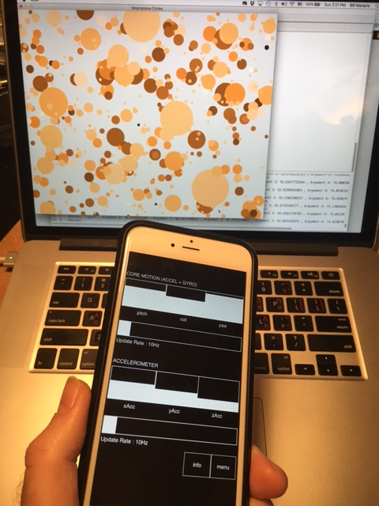

# Chapter 9: Making Connections

***Topics:*** *Connecting to MIDI devices (pianos, guitars, etc.), the Python MIDI library, MIDI programming, Open Sound Control (OSC) protocol, connecting to OSC devices (smartphones, tablets, etc.), send / receive OSC messages, the Python OSC library, creating hybrid (traditional + computer) musical instruments.*

In the [previous chapter](ch8.md), we began designing unique interactive musical instruments for live performance. In this chapter, we explore how to create connections between a computer and external devices, such as MIDI controllers, synthesizers, and smartphones, via the MIDI and OSC protocols. More information is provided in the [reference textbook](https://goo.gl/Y1VM5t).

Here is sample code and examples:

- [MIDI input](#midi-input)
- [Process incoming MIDI notes](#process-incoming-midi-notes)
- [Process arbitrary MIDI messages](#process-arbitrary-midi-messages)
- [Create custom MIDI synthesizer #1](#create-custom-midi-synthesizer-1)
- [Create custom MIDI synthesizer #2](#create-custom-midi-synthesizer-2)
- [Draw circles through MIDI input](#draw-circles-through-midi-input)

- [MIDI output](#midi-output)
- [Play notes on a synthesizer](#play-notes-on-a-synthesizer)
- [Send arbitrary messages to a DAW](#send-arbitrary-messages-to-a-daw)

- [OSC input](#osc-input)
- [OSC messages](#osc-messages)
- [When an OSC message arrives, print “Hello World!”](#when-an-osc-message-arrives-print-hello-world)
- [Process arbitrary OSC messages](#process-arbitrary-osc-messages)
- [Change display color continuously via OSC](#change-display-color-via-osc)
- [Build a simple piano playable via OSC](#build-a-simple-piano-playable-via-osc)
- [Clementine – making music with a smartphone](#clementine-making-music-with-a-smartphone)

- [Monterey Mirror – a hybrid instrument](#monterey-mirror-a-hybrid-instrument)

---

## MIDI input

To build programs that communicate via [MIDI](https://www.midi.org/), you need the following statement:

```python
from midi import *
```

To receive input from a MIDI device, create a [MIDI input](../api/midi/midiin/index.md) object:

```python
midiIn = MidiIn()
```

This opens a GUI to select a MIDI input device.

After selecting the device, your program receives MIDI messages from it, as shown here:

<iframe class="pm-demo" style="max-width: 400px; aspect-ratio: 400 / 518;" src="https://video.wordpress.com/embed/w7qHIn9T?preloadContent=metadata&controls=1" title="MIDI input demo" allowfullscreen></iframe>

---

## Process incoming MIDI notes

This sample code **demonstrates how to process incoming MIDI notes**.  It assigns a callback function to MIDI Note-On messages. This function prints the pitch and volume of the incoming MIDI message – but it could do anything we want with this data.

These callback functions must have four parameters:

- event type (an integer)
- channel (0 – 15)
- data1 (pitch, 0 – 127)
- data2 (volume, 0 – 127)

Here is the code:

```python linenums="1" title="midiIn1.py"
--8<-- "examples/_snippets/midiIn1.py"
```

Here is the output:

<iframe class="pm-demo" style="max-width: 400px; aspect-ratio: 400 / 511;" src="https://video.wordpress.com/embed/R07wWTCs?preloadContent=metadata&controls=1" title="Process incoming MIDI notes demo" allowfullscreen></iframe>

---

## Process arbitrary MIDI messages

This program  **demonstrates how to process arbitrary incoming MIDI messages**.  It assigns a callback function to be called for any incoming message. This particular function explores what type of message it has received and prints out its data – however, it could do almost anything with this data.  This program can process messages from any MIDI controller, such as the [Akai MPK Mini keyboard](https://www.sweetwater.com/store/detail/MPKmini2), or a [custom Arduino controller](http://www.instructables.com/id/Easy-3-Pot-Potentiometer-Arduino-Uno-Effects-Midi-/).

Here is the code:

```python linenums="1" title="midiIn3.py"
--8<-- "examples/_snippets/midiIn3.py"
```

Here is the output:

<iframe class="pm-demo" style="max-width: 400px; aspect-ratio: 400 / 447;" src="https://video.wordpress.com/embed/TU1372f6?preloadContent=metadata&controls=1" title="Process arbitrary MIDI messages demo" allowfullscreen></iframe>

---

## Create custom MIDI synthesizer #1

This sample code **demonstrates how to create a simple MIDI synthesizer**.  It assigns two callback functions, one to MIDI Note-On messages, and one to Note-Off messages. This turns an inexpensive MIDI controller (e.g., [Akai MPK Mini keyboard](https://www.sweetwater.com/store/detail/MPKmini2)) into a regular synthesizer. You can expand this program, by adding more functions for other MIDI events, to create a more elaborate synthesizer. You can design it to do what you wish (including generate visuals, etc.).

Here is the code:

```python linenums="1" title="midiSynthesizer.py"
--8<-- "examples/_snippets/midiSynthesizer.py"
```

Here is the output:

<iframe class="pm-demo" style="max-width: 400px; aspect-ratio: 400 / 442;" src="https://video.wordpress.com/embed/nyX3o9oC?preloadContent=metadata&controls=1" title="Custom MIDI synthesizer demo" allowfullscreen></iframe>

Another possibility is to use an AudioSample (instead of MIDI), which essentially creates a regular synthesizer:

```python linenums="1" title="audioSynthesizer.py"
--8<-- "examples/_snippets/audioSynthesizer.py"
```

---

## Create custom MIDI synthesizer #2

This sample code **demonstrates how to create a more advanced MIDI synthesizer**.  It extends the previous example by adding the capability to change MIDI instruments by turing one of the the MIDI controller knobs.

**NOTE:** To set which knob to use, find the data1 value that particular knob sends when turned (see MidiIn [showMessages()](../api/midi/midiin/showMessages.md) function).

Here is the code:

```python linenums="1" title="midiSynthesizer2.py"
--8<-- "examples/_snippets/midiSynthesizer2.py"
```

---

## Draw circles through MIDI input

This code sample ([Ch. 9, p. 291](http://goo.gl/Io4kLk)) demonstrates how to do something more advanced with incoming MIDI messages.  It **draws circles on a display based on the pitch and volume of incoming MIDI notes**.  Each input note generates a circle – the lower the note, the lower the red+blue components of the circle color. The louder the note, the larger the circle. The position of the circle on the display is random.

Here is the code:

```python linenums="1" title="randomCirclesThroughMidiInput.py"
--8<-- "examples/_snippets/randomCirclesThroughMidiInput.py"
```

Here is the output:

<iframe class="pm-demo" style="max-width: 584px; aspect-ratio: 584 / 412;" src="https://video.wordpress.com/embed/WlaqlvsN?preloadContent=metadata&controls=1" title="Draw circles through MIDI input demo" allowfullscreen></iframe>

---

## MIDI output

To send output to a MIDI device, create a [MIDI output](../api/midi/midiout/index.md) object:

```python
midiOut = MidiOut()
```

This opens a GUI to select a MIDI output device.

After selecting the device, your program can send MIDI messages to it, as shown here:

<iframe class="pm-demo" style="max-width: 400px; aspect-ratio: 400 / 511;" src="https://video.wordpress.com/embed/YPyeUUuz?preloadContent=metadata&controls=1" title="MIDI output demo" allowfullscreen></iframe>

---

## Play notes on a synthesizer

This program  **demonstrates how to drive an external MIDI synthesizer**.  It opens a connection to an external synthesizer and plays a note on it.

Here is the code:

```python linenums="1" title="midiOut.py"
--8<-- "examples/_snippets/midiOut.py"
```

---

## Send arbitrary messages to a DAW

This program  **demonstrates how to send arbitrary messages to your DAW (or a MIDI synthesizer)**.  It sends an All Notes Off message across all channels (to stop any playing MIDI notes).  Instead, you could [a play a score, or send other types of messages](../api/midi/midiout/index.md).

Here is the code:

```python linenums="1" title="midiOut.py"
--8<-- "examples/_snippets/midiOutSendMessages.py"
```

For more information, see the [standard MIDI control messages](http://www.indiana.edu/~emusic/cntrlnumb.html), or documentation on the particular DAW (or synthesizer).

---

## OSC input

To build programs that communicate via [OSC](http://opensoundcontrol.org/introduction-osc), you need the following statement:

```python
from osc import *
```

To receive input from an OSC device, create a [OSC input](../api/osc/oscin/index.md) object:

```python
oscIn = OscIn( port )
```

This object receives incoming OSC messages on *port* (e.g., 57110 – a port number not used elsewhere).

**NOTE:** For remote connections, make sure any firewall between you and the other device permit communication via this port (UPD).

---

## OSC messages

OSC messages consist of an *address* and optional *arguments*, e.g., “/oscillator/4/frequency 440.0”:

- *Address* patterns look like a URL, e.g., “/oscillator/4/frequency”, “/button/1”, “slider/3”, etc.  Any address is possible, as long as both OSC input and output devices use the same values.  You can create your own, or use what a particular OSC device sends, e.g., [TouchOSC](https://hexler.net/software/touchosc).
- *Arguments* may be integers, floats, strings, and booleans.  OSC messages may include an arbitrary number of arguments (zero or more).

---

## When an OSC message arrives, print “Hello World!”

This sample program **demonstrates how to run arbitrary code when an OSC message arrives**.  It assigns a callback function to be called anytime an OSC message arrives with the address “/helloWorld”.

```python linenums="1" title="oscIn1.py"
--8<-- "examples/_snippets/oscIn1.py"
```

When you run this program, it outputs the following:

> OSC Server started:
> Accepting OSC input on IP address
> xxx.xxx.xxx.xxx at port 57110
> (use this info to configure OSC clients)

where “xxx.xxx.xxx.xxx” is the IP address of the receiving computer (e.g., “192.168.1.223”)

This IP address and port information is needed to set up an external OSC device, so it can send messages to this program.

---

## Process arbitrary OSC messages

This program  **demonstrates how to see what type of messages an OSC device (e.g., a smartphone app) generates**.  It assigns a callback function to all incoming OSC messages.  This function outputs the data stored in the incoming messages.  This way, you can explore what type of messages (e.g., event types) an arbitrary OSC device generates. Then, you may assign different callback functions to be executed when they arrive.

```python linenums="1" title="oscIn2.py"
--8<-- "examples/_snippets/oscIn2.py"
```

Notice the special OSC address “/.*”

- this matches for all incoming addresses
- onInput() uses *regular expressions* to specify OSC addresses
- usually simple OSC addresses suffice,
    - e.g., “/gyro”
    - “/accelerometer”, etc.
- also note [showMessages()](../api/osc/oscin/showMessages.md) and [hideMessages()](../api/osc/oscin/hideMessages.md).

---

## Change display color via OSC

This program demonstrates how to use a smartphone’s movement via [Touch OSC Mk1](https://hexler.net/touchosc-mk1#get) to change the color of a display.

```python linenums="1" title="changeDisplayColorOSC.py"
--8<-- "examples/_snippets/changeDisplayColorOSC.py"
```

---

## Build a simple piano playable via OSC

This adapts the [virtual piano example from Ch. 8](ch8.md#creating-a-virtual-piano) to demonstrate how to play that piano using OSC messages.  This code uses the [Touch OSC Mk1](https://hexler.net/touchosc-mk1#get) app.

```python linenums="1" title="iPianoSimpleOSC.py"
--8<-- "examples/_snippets/iPianoSimpleOSC.py"
```

---

## Clementine – making music with a smartphone

Clementine demonstrates how to make music with your smartphone. This code sample ([Ch 9. p. 307](http://goo.gl/Io4kLk)) **receives input from a smartphone, using the OSC protocol**.  To send OSC data from the smartphone, we used the app, [TouchOSC](http://hexler.net/software/touchosc). Other OSC apps can be used with a little modification to the code below.

<figure markdown="span">
  { width="320" }
  <figcaption>Using a smartphone to create music on a laptop (via OSC messages)</figcaption>
</figure>

## Performance Instructions

This program creates a musical instrument out of your smartphone.  It has been specifically designed to allow the following performance gestures:

- **Ready Position:**  Hold your smartphone in the palm of your hand, flat and facing up, as if you are reading the screen.  Make sure it is parallel with the floor.  Think of an airplane resting on top of your device’s screen, its nose pointing away from you, and its wings flat across the screen (left wing superimposed with the left side of your screen, and right wing with the right side of your screen).
- **Controlling Pitch:**  The pitch of the airplane (the angle of its nose – pointing up or down) corresponds to musical pitch.  The higher the nose, the higher the pitch.
- **Controlling Rate:**  The roll of the airplane (the banking of its wings to the left or to the right) triggers note generation.  You could visualize notes falling off the device’s screen, so when you roll/bank the device, notes escape (roll off).
- **Controlling Volume:**   Device shake corresponds with loudness of notes. The more intensely you shake or vibrate the device as notes are generated, the louder the notes are.

**To summarize**, the smartphone’s orientation (pointing from zenith to nadir) corresponds to pitch (high to low). Shaking the device plays a note—the stronger, the louder. Tilting the device produces more notes.

On the server side, i.e., the program you are controlling with your smartphone:

- Note pitch is mapped to color of circles (lower means darker/browner, higher means brighter/redder/bluer).
- Shake strength is mapped to circle size (radius).
- Finally, the position of the circle on the display is random.

All these settings could easily be changed.  We leave that as an exercise.

Here is the program:

```python linenums="1" title="clementine.py"
--8<-- "examples/_snippets/clementine.py"
```

Using OSC you can design innovative performance projects, where you might allow many OSC clients (e.g., smartphones in the audience) control aspects of your performance on stage. This allows you to build sophisticated musical instruments and artistic installations.

---

## Monterey Mirror – a hybrid instrument

Here is an example of a hybrid instrument, called *Monterey Mirror*. Monterey Mirror consists of a MIDI instrument (here a guitar) and a computer. This is **an experiment in interactive music performance**, where a human (the performer) and a computer (the mirror) engage in a game of playing, listening, and learning from each other.

<iframe class="pm-video" src="https://www.youtube.com/embed/tCGzIg-73Tw" title="Monterey Mirror" allowfullscreen></iframe>

Additionally, you may create **new musical instruments**, which may consist of smartphones and or tablets that somehow drive, guide, or contribute to the making of sound. For more information, see the [reference textbook](https://goo.gl/Y1VM5t).
