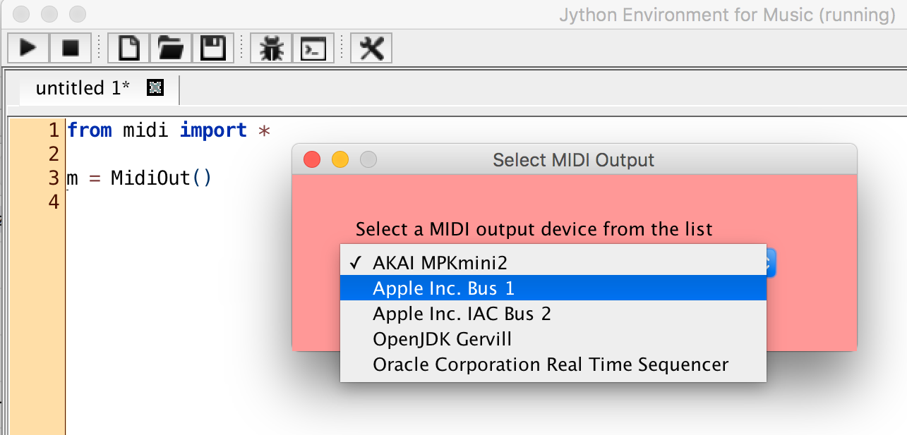

# Frequently Asked Questions

Here is a list of frequently asked questions / issues:

| Question |
|---|
| 1. [Is there a public forum to post music, code, and other artifacts created with PythonMusic?](#1-is-there-a-public-forum-to-post-music-code-and-other-artifacts-created-with-pythonmusic)|
| 2. [Can I use other editors to run PythonMusic programs?](#2-can-i-use-other-editors-to-run-pythonmusic-programs) |
| 3. [How do I use a different MIDI soundfont?](#3-how-do-i-use-a-different-midi-soundfont) |
| 4. [Can I use sounds from Logic Pro, Ableton Live, Reaper (or other software)?](#4-can-i-use-sounds-from-logic-pro-ableton-live-reaper-or-other-software) |
| 5. [Can I play microtones?](#5-can-i-play-microtones) |
| 6. [Can I use the MIDI auto-learn feature in Ableton Live (or other DAW)?](#6-can-i-use-the-midi-auto-learn-feature-in-ableton-live-or-other-daw) |
| 7. [How to find answers to other questions?](#7-how-to-find-answers-to-other-questions) |

---

## 1. Is there a public forum to post music, code, and other artifacts created with PythonMusic?

We are working on securing a forum for public collaboration in PythonMusic; it will be ready soon!

In the meantime, you can join the [JythonMusic Facebook group](https://www.facebook.com/groups/jythonmusic/). This forum is intended for posting and discussing music, code, or other artifacts created with JythonMusic, which is compatible with PythonMusic. However, if you have a technical question, see below.

---

## 2. Can I use other editors to run PythonMusic programs?

Yes.  PythonMusic code can be written and run in any Python-capable editor. 

---

## 3.  How do I use a different MIDI soundfont?

PythonMusic looks in 3 places when choosing its soundfont:

1. Where your code is running in.

2. A `soundfonts/` folder where your code is running in.

3. A `soundfonts/` folder in your home directory.

The `music` library uses the first `.sf2` file it finds.  If no soundfonts are found, [FluidR3 GM2-2.SF2](https://www.dropbox.com/s/xixtvox70lna6m2/FluidR3%20GM2-2.SF2?dl=0) is the default.

You can check the currently loaded soundfont using [`Play.getSoundfont()`](api/music/play/getSoundfont.md), and you can load a soundfont from anywhere on your computer using [`Play.setSoundfont()`](api/music/play/setSoundfont.md).

---

## 4. Can I use sounds from Logic Pro, Ableton Live, Reaper (or other software)?

Yes, you can.

Most digital audio workstation (DAW) software (e.g., Logic Pro, Reaper, Ableton Live, etc.) can receive MIDI notes, and play them using their own sounds.

To do that:

- On the PEM side, create a [MidiOut](api/midi/midiout/index.md) object and select the default MIDI port (see attached image, for Mac).

<figure markdown="span">
  
  <figcaption>Select your computer’s default MIDI port for output (on Mac)</figcaption>
</figure>

- On the DAW side (e.g., Logic Pro, etc.), create a MIDI track and make it receive input from the default Apple MIDI port.

The same approach works on Windows, and Linux.

**NOTE:** Some programs, such as [SimpleSynth](http://notahat.com/simplesynth/) (Mac, free), or [MainStage](http://www.apple.com/mainstage/) (Mac, $29), make this **extremely** easy.  Other programs (e.g., Logic Pro) require a bit more effort.

Finally, you could use [OSC messages](api/osc/oscout/index.md) instead.  Same idea.

---

## 5. Can I play microtones?

Yes, you can.

Microtones may be rendered in two ways:

- using the [standard MIDI synthesizer](api/music/play/index.md), or
- using [pre-recorded audio files](api/music/play/audio.md) as instruments.

There are some limitations, however.

*Using the standard MIDI synthesizer:*  Since the MIDI standard does not support microtones, JythonMusic creates microtones using MIDI pitch bend.  MIDI has only one pitch bend per channel.  Therefore, for **microtonal MIDI polyphony,** you have to **spread concurrent notes across channels**.  Since MIDI has a total of 16 channels (of which channel 9 is reserved for percussive sounds), only **a maximum of 15 concurrent microtonal notes** is possible in MIDI**.**

*Using pre-recorded audio files:*  For consistency with MIDI, you can have **a maximum of 16 concurrent microtonal notes** (since, for audio instruments, we can also use channel 9). You need to **load as many audio files as channels used** (each audio file can render only a single note at a time).  Again, **you need to spread concurrent notes across channels**.  Also, you may be limited by your computer’s memory and CPU speed (since audio files — having much better quality — utilize extra memory and CPU cycles).

For more information, see [Microtonality](api/music/microtonality.md).

---

## 6. Can I use the MIDI auto-learn feature in Ableton Live (or other DAW)?

Yes.

Using the **MIDI-learn feature** of Ableton Live (or other DAW, e.g., Reaper, etc.) will automatically connect any MIDI notes send via PEM to any function supported by your DAW (Ableton Live, Reaper, etc.).

Here is how:

1. Put your DAW in MIDI-learn mode.
2. Send a MIDI note from PEM.
3. Exit your DAW’s MIDI-learn mode.

You can use this for as many DAW functions are you wish.

**Caution:**  Do **NOT press PEM’s stop button**, while your DAW is in learn mode!!!

When stop is pressed, PEM sends a message to stop all notes (CC 123 – all channels). This is done to turn off all sounds generated by equipment connected to PEM (as one might expect).

So, **first turn MIDI learning off in the DAW,** and **then press the stop button in JEM**. Otherwise, the DAW will also learn the stop message, which is something you probably do not want…

---

## 7. How to find answers to other questions?

Questions, bug reports, feature requests, and contributions can be posted to [the PythonMusic Github](https://github.com/ydhadix/PythonMusic).

We are working on securing a forum for public collaboration in PythonMusic; it will be ready soon!

In the meantime, you can also post and view questions about JythonMusic on [Stack Overflow](https://stackoverflow.com/search?q=JythonMusic), or the [JythonMusic Facebook group](https://www.facebook.com/groups/jythonmusic/).

Also, if you know the answer to [a posted question](https://stackoverflow.com/search?q=JythonMusic), feel free to contribute.  Thanks!
