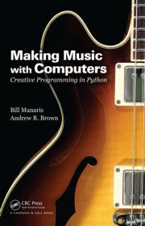

# Overview

PythonMusic is an environment for music making and creative programming. It is meant for musicians and programmers alike, of all levels and backgrounds.

PythonMusic provides composers and software developers with libraries for music making, image manipulation, building graphical user interfaces, and connecting to external devices, such as digital pianos, smartphones, and tablets.

PythonMusic is based on Python programming.  It is easy to learn for beginners, and powerful enough for experts.

---

## In Education

PythonMusic is used in computer programming classes combining music and art.  Here is a first-year university class performing [Terry Riley’s “In C”](https://en.wikipedia.org/wiki/In_C).

<iframe class="pm-video" src="https://www.youtube.com/embed/txS7awpCCh8" title="Laptop Orchestra performs Terry Riley's In C" allowfullscreen></iframe>

---

## In Music

PythonMusic supports musicians with its familiar music data structure based upon note/sound events, and provides methods for organizing, manipulating and analyzing such musical data. PythonMusic scores can be played back in real-time, rendered as MIDI or XML, and drive external synthesizers and DAWs (e.g., Ableton, LogicPro, and PureData).

<iframe class="pm-video" src="https://www.youtube.com/embed/YSZ42QvKCOs" title="Liminal Space (2018)" allowfullscreen></iframe>

PythonMusic can connect to external MIDI controllers and OSC devices (e.g., smartphones and tablets) for musical or other purposes.  Here is an interface utilizing Myo armbands and PureData to control a performance half-way around the world.

<iframe class="pm-video" src="https://player.vimeo.com/video/233398245" title="SoundMorpheus" allowfullscreen></iframe>

---

## In Art

PythonMusic is used in art projects.  It works well with other tools, like MIT Processing and PureData.  Here is an [interactive multimedia art installation](http://halsey.cofc.edu/exhibitions/jody-zellen-above-the-fold/) developed using PythonMusic.

<iframe class="pm-video" src="https://player.vimeo.com/video/233708606" title="Time Jitters" allowfullscreen></iframe>

---

## In Research

PythonMusic is designed to be extendible, encouraging you to build upon its functionality by programming in Python to create your own musical compositions, tools, and instruments.  Here is a hyperinstrument consisting of guitar and computer, for a research project in computer-aided music composition.

<iframe class="pm-video" src="https://www.youtube.com/embed/tCGzIg-73Tw" title="Monterey Mirror" allowfullscreen></iframe>

---

## About

### It is free

PythonMusic is free, in the spirit of other tools, like PureData and MIT Processing.  It is an open source project.

PythonMusic is 100% CPython and works on Windows, Mac OS, Linux, or any other platform with Python support.

### It comes with a textbook

{ align="right" width="180" }

PythonMusic comes with a [textbook](https://goo.gl/Y1VM5t).  The textbook is intended for

- **students** in computing in the arts, or music technology courses
- **musicians**, who are beginning programmers, to learn Python in a musical way
- **programmers**, who are beginning musicians, to learn essential music concepts in a programming way
- **musician programmers** (or programmer musicians), who seek inspiration, and a new, comprehensive way to interweave music composition, music performance, and computing.

For more information, see

- B. Manaris and A. Brown, Making Music with Computers: Creative Programming in Python, Chapman & Hall/CRC Textbooks in Computing, May 2014. (see [Amazon](https://goo.gl/Y1VM5t), and [CRC Press](http://goo.gl/Io4kLk) links)
- B. Manaris, B. Stevens, and A.R. Brown, “JythonMusic: An environment for teaching algorithmic music composition, dynamic coding and musical performativity”, Journal of Music, Technology & Education, 9: 1, pp. 33–56, May 2016. ([doi: 10.1386/jmte.9.1.33_1](https://doi.org/10.1386/jmte.9.1.33_1))

This material supports the [AP Computer Science Principles Curriculum](articles/cs-principles.md).

---

## Credits

PythonMusic is developed by [Bill Manaris](http://manaris.org/), Taj Ballinger, Trevor Ritchie, Kenneth Hanson, Dana Hughes, David Johnson, Seth Stoudenmier, Christopher Benson, Margaret Marshall, and William Blanchett.

PythonMusic is based on the [jMusic computer-assisted composition framework](http://explodingart.com/jmusic/), created by [Andrew Brown](http://explodingart.com/wp/) and [Andrew Sorensen](https://vimeo.com/andrewsorensen).

The PEM editor is based on the [TigerJython](https://tigerjython.com/en) editor developed by [Tobias Kohn](https://tobiaskohn.ch/) and Python's native [IDLE](https://docs.python.org/3/library/idle.html) editor .

{ align="left" width="50" } Various components have been supported by the US National Science Foundation (DUE-1323605, DUE-1044861, IIS-0736480, IIS-0849499 and IIS-1049554).